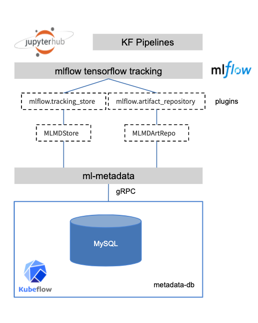

## MLDMD Store PlugIn for MLFlow

This repository provides a MLflow plugin that allows users to use MLMD as a tracking backend



## Implementation overview
This repository contains one Python package:

`mlmdstore`: This package includes the `MLMDStore` class that is used to read and write tracks to the gRPC MLDM endpoint.

```
entry_points={
        "mlflow.tracking_store": [
            "mlmd=mlmdstore.store.tracking:MLMDStore"
        ]
    }
```

## User experience

The proposed plugin structure and development workflow provide the following experience to the end user:

Users can simply install MLflow with the MLDM Server plugin via `pip install mlflow[mlmldstore]` and then use MLflow as normal.


